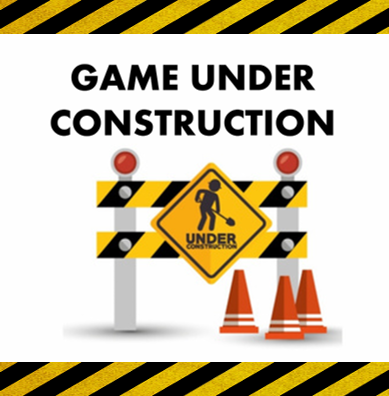

[![Contributors][contributors-shield]][contributors-url]
[![MIT License][license-shield]][license-url]
[![LinkedIn][linkedin-shield]][linkedin-url]

[![Status][badge]](https://github.com/RodrigoQuiroz09/MazeHunter)

<!-- PROJECT LOGO -->
 

  

<h2 align="center">Maze Hunter</h2>

  

    <a href="https://github.com/RodrigoQuiroz09/MazeHunter">View Demo</a>
    ·
    <a href="https://github.com/RodrigoQuiroz09/MazeHunter">Explore the GDD</a>
  

<!-- TABLE OF CONTENTS -->

  
Table of Contents

  <ol>
    <li>
      <a href="#about-the-project">About The Project</a>
      <ul>
        <li><a href="#built-with">Built With</a></li>
      </ul>
    </li>
    <li><a href="#roadmap">Roadmap</a></li>
    <li><a href="#contributing">Contributing</a></li>
    <li><a href="#license">License</a></li>
    <li><a href="#acknowledgments">Acknowledgments</a></li>
  </ol>

<!-- ABOUT THE PROJECT -->

## About The Project

[![Product Name Screen Shot][product-screenshot]](https://example.com)

- Personal project only to show on portfolio
- A small scoped mobile game planned to be as a starting point for future projects and practice skills to be a game developer in Unity3D. It is meant to be for people looking for an arcade-ish type of game where you feel the adrenaline and love the progressive type of games.

### Pitch

- You play as a bounty hunter trapped into an altern dimension and must get to the end to gain a great treasure and go back to where you came from.

(<a href="#top">back to top</a>)

### Built With

- [![Unity][unity.com]][unity-url]
- [![C#][csharp.com]][csharp-url]
- [![NET#][net.com]][net-url]

### External tools

- [![Unity][unity-a.com]][unity-a-url]
- [![itchio][itchio.com]][itchio-url]
- [![Notion][notion.com]][notion-url]
- [![VSCode][vsc.com]][vsc-url]
  - <strong>Core Extensions</strong>
  - C# XML Documentation Comments
  - C# v1.24.4
  
(<a href="#top">back to top</a>)

<!-- GETTING STARTED -->

## Requirements

- Unity Version 2020.2.12f1 or Newer
- C# Programming Language
- [DoTween Library](http://dotween.demigiant.com/index.php)
- Text Mesh Pro (Unity Library)

(<a href="#top">back to top</a>)

<!-- ROADMAP -->

## Roadmap

- [ ] Feature 1
- [ ] Feature 2
- [ ] Feature 3
  - [ ] Nested Feature

See the [Notion To-Do list](https://silicon-grill-d89.notion.site/d627b4bcd4ec4b26b351d69db06610e2?v=89686b9c280b466a93deb1e74048e5c5) for a full list of proposed features (and known issues).

(<a href="#top">back to top</a>)

<!-- CONTRIBUTING -->

## Contributing

This is a open source game, everyone is invited to take the project as starting project or for reference in certain mechanics.

(<a href="#top">back to top</a>)

<!-- LICENSE -->

## License

Distributed under the MIT License. See `LICENSE.md` for more information.

(<a href="#top">back to top</a>)

<!-- ACKNOWLEDGMENTS -->

## Acknowledgments

- 
- 
- 

(<a href="#top">back to top</a>)

<!-- MARKDOWN LINKS & IMAGES -->
<!-- https://www.markdownguide.org/basic-syntax/#reference-style-links -->

[contributors-shield]: https://img.shields.io/github/contributors/RodrigoQuiroz09/MazeHunter.svg?style=for-the-badge
[contributors-url]: https://github.com/RodrigoQuiroz09/MazeHunter/graphs/contributors
[license-shield]: https://img.shields.io/github/license/RodrigoQuiroz09/MazeHunter.svg?style=for-the-badge
[license-url]: https://github.com/RodrigoQuiroz09/MazeHunter/blob/master/LICENSE.txt
[linkedin-shield]: https://img.shields.io/badge/-LinkedIn-black.svg?style=for-the-badge&logo=linkedin&colorB=555
[linkedin-url]: https://linkedin.com/in/linkedin_username
[product-screenshot]: images/screenshot.png
[unity-url]: https://unity.com
[unity.com]: https://img.shields.io/badge/Unity-100000?style=for-the-badge&logo=unity&logoColor=white
[unity-a-url]: https://assetstore.unity.com
[unity-a.com]: https://img.shields.io/badge/Unity-Asset-Store?style=for-the-badge&logo=unity&logoColor=white
[csharp-url]: https://docs.microsoft.com/en-us/dotnet/csharp/
[csharp.com]: https://img.shields.io/badge/C%23-239120?style=for-the-badge&logo=c-sharp&logoColor=white
[notion-url]: https://www.notion.so/product?fredir=1
[notion.com]: https://img.shields.io/badge/Notion-000000?style=for-the-badge&logo=notion&logoColor=white
[vsc-url]: https://code.visualstudio.com
[vsc.com]: https://img.shields.io/badge/Visual_Studio_Code-0078D4?style=for-the-badge&logo=visual%20studio%20code&logoColor=white
[net-url]: https://dotnet.microsoft.com/en-us/
[net.com]: https://img.shields.io/badge/.NET-5C2D91?style=for-the-badge&logo=.net&logoColor=white
[itchio-url]: https://itch.io
[itchio.com]: https://img.shields.io/badge/Itch.io-FA5C5C?style=for-the-badge&logo=itchdotio&logoColor=white
[badge]: https://img.shields.io/badge/Status-On--Progress-green?style=for-the-badge
